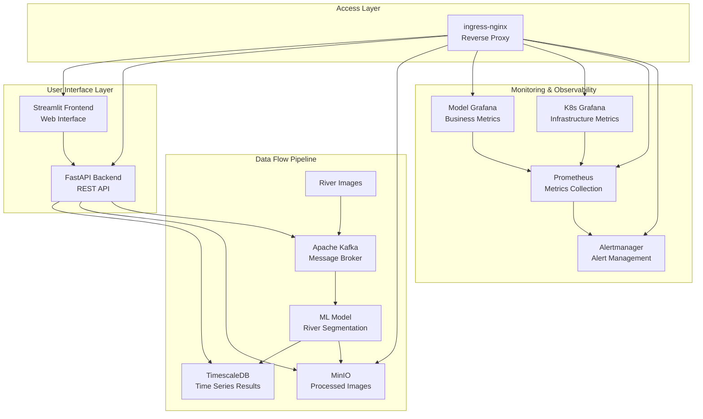

# River Segmentation Stack - Deployment Guide

A comprehensive Kubernetes-based application for real-time river segmentation using machine learning, featuring automated image processing, monitoring, and data persistence.

## 🌊 What This Application Does

The River Segmentation Stack is an end-to-end solution that:

1. **Processes River Images**: Consumes river images from a Kafka stream
2. **Applies ML Segmentation**: Uses a trained machine learning model to segment river areas from satellite/aerial imagery
3. **Stores Results**: Saves processed data to TimescaleDB (time-series database) and MinIO (object storage)
4. **Provides Web Interface**: Offers a Streamlit frontend for visualization and interaction
5. **Monitors Performance**: Tracks application and infrastructure metrics with dual Grafana dashboards
6. **Manages Data Flow**: Uses Kafka for reliable message streaming and data pipeline orchestration

## 🏗️ Architecture & Data Flow



## 🧩 Component Relationships & Communication

### **Primary Data Processing Chain**
1. **Images** → **Kafka** (message streaming) → **ML Model** (segmentation processing) → **TimescaleDB + MinIO** (persistent storage)
2. **Frontend** → **Backend** → **Databases** (for historical data retrieval and visualization)

### **Monitoring & Observability Chain**
1. **All Services** → **Prometheus** (metrics collection) → **Grafana Dashboards** (visualization)
2. **Model Grafana**: Business metrics (processing time, accuracy, throughput, model performance)
3. **K8s Grafana**: Infrastructure metrics (CPU, memory, pods, nodes, cluster health)

### **Network Access Pattern**
1. **External Users** → **ingress-nginx** → **All Services** (unified access point)
2. **Cross-namespace Services** → **ExternalName Proxies** → **Monitoring Namespace** (for monitoring stack access)

## 📋 Complete Step-by-Step Deployment Guide

### Phase 1: Infrastructure Preparation

#### Step 1.1: Initialize Minikube Cluster
```powershell
# Start Minikube with adequate resources for the full stack
minikube start --memory=4096 --cpus=2 --driver=docker

# Enable essential addons
minikube addons enable ingress
minikube addons enable metrics-server

# Verify cluster readiness
kubectl cluster-info
kubectl get nodes
```

#### Step 1.2: Setup Helm Package Manager
```powershell
# Add all required Helm repositories
helm repo add ingress-nginx https://kubernetes.github.io/ingress-nginx
helm repo add prometheus-community https://prometheus-community.github.io/helm-charts
helm repo add strimzi https://strimzi.io/charts/
helm repo update

# Verify repositories
helm repo list
```

#### Step 1.3: Install Core Infrastructure Components
```powershell
# Install ingress-nginx controller (reverse proxy for all services)
helm install ingress-nginx ingress-nginx/ingress-nginx `
  --namespace ingress-nginx `
  --create-namespace `
  --values nginx/ingress-nginx-values.yaml

# Wait for ingress controller to be ready
kubectl wait --namespace ingress-nginx `
  --for=condition=ready pod `
  --selector=app.kubernetes.io/component=controller `
  --timeout=300s

# Verify ingress controller
kubectl get pods -n ingress-nginx
```

### Phase 2: Data Storage Layer Deployment

#### Step 2.1: Deploy TimescaleDB (Time-Series Database)
```powershell
# Navigate to databases directory
cd databases

# Create secret containing database credentials
kubectl create secret generic timescaledb-secret --from-env-file=timescaledb-secrets.env

# Deploy TimescaleDB StatefulSet
kubectl apply -f timescaledb-app.yaml

# Wait for TimescaleDB pods to be ready
kubectl wait --for=condition=ready pod -l app=timescaledb-app --timeout=300s

# Initialize database schema and tables
kubectl apply -f timescaledb-init-job.yaml

# Verify database initialization completed
kubectl wait --for=condition=complete job/timescaledb-init-job --timeout=300s

# Check TimescaleDB status
kubectl get pods -l app=timescaledb-app
kubectl logs -l app=timescaledb-app --tail=20
```

#### Step 2.2: Deploy MinIO (Object Storage)
```powershell
# Create secret containing MinIO credentials (still in databases directory)
kubectl create secret generic minio-secrets --from-env-file=minio-secrets.env

# Deploy MinIO StatefulSet for object storage
kubectl apply -f minio-app.yaml

# Wait for MinIO pods to be ready
kubectl wait --for=condition=ready pod -l app=minio-app --timeout=300s

# Create initial bucket for storing processed images
kubectl apply -f minio-bucket-job.yaml

# Verify bucket creation completed
kubectl wait --for=condition=complete job/minio-bucket-job --timeout=180s

# Check MinIO status
kubectl get pods -l app=minio-app
kubectl get svc -l app=minio-app
```

### Phase 3: Messaging Infrastructure Deployment

#### Step 3.1: Install Kafka Operator
```powershell
# Navigate to kafka directory
cd ../kafka

# Install Strimzi Kafka operator
helm install strimzi-kafka-operator strimzi/strimzi-kafka-operator `
  --namespace kafka `
  --create-namespace

# Wait for Strimzi operator to be ready
kubectl wait --namespace kafka `
  --for=condition=ready pod `
  --selector=name=strimzi-cluster-operator `
  --timeout=300s

# Verify operator installation
kubectl get pods -n kafka
```

#### Step 3.2: Deploy Kafka Cluster
```powershell
# Deploy Kafka cluster configuration (this creates the Kafka cluster)
kubectl apply -f kafka-config.yaml

# Wait for Kafka cluster to be ready (this can take several minutes)
kubectl wait kafka/my-cluster --for=condition=Ready --timeout=600s -n kafka

# Deploy service for cross-namespace Kafka access
kubectl apply -f kafka-service.yaml

# Deploy Kafka UI for cluster management
kubectl apply -f kafka-ui.yaml

# Wait for Kafka UI to be ready
kubectl wait --for=condition=ready pod -l app=kafka-ui -n kafka --timeout=180s

# Verify Kafka cluster
kubectl get kafka -n kafka
kubectl get pods -n kafka
```

### Phase 4: Application Services Deployment

#### Step 4.1: Deploy Backend Service (FastAPI REST API)
```powershell
# Navigate to backend directory
cd ../backend

# Create configuration for backend service
kubectl create configmap backend-config --from-env-file=backend-config.env

# Create secrets for backend service
kubectl create secret generic backend-secrets --from-env-file=backend-secrets.env

# Deploy backend application
kubectl apply -f backend-app.yaml

# Wait for backend to be ready
kubectl wait --for=condition=ready pod -l app=river-backend --timeout=300s

# Deploy horizontal pod autoscaler for backend
kubectl apply -f backend-hpa.yaml

# Verify backend deployment
kubectl get pods -l app=river-backend
kubectl logs -l app=river-backend --tail=20
```

#### Step 4.2: Deploy Frontend Service (Streamlit Web Interface)
```powershell
# Navigate to frontend directory
cd ../frontend

# Create configuration for frontend service
kubectl create configmap frontend-config --from-env-file=frontend-config.env

# Deploy frontend application
kubectl apply -f frontend-app.yaml

# Wait for frontend to be ready
kubectl wait --for=condition=ready pod -l app=river-frontend --timeout=300s

# Deploy horizontal pod autoscaler for frontend
kubectl apply -f frontend-hpa.yaml

# Verify frontend deployment
kubectl get pods -l app=river-frontend
kubectl logs -l app=river-frontend --tail=20
```

#### Step 4.3: Deploy Model Grafana (Application Monitoring Dashboard)
```powershell
# Create secrets for Grafana (still in frontend directory)
kubectl create secret generic grafana-secrets --from-env-file=grafana-secrets.env

# Deploy model monitoring Grafana
kubectl apply -f grafana-app.yaml

# Wait for Grafana to be ready
kubectl wait --for=condition=ready pod -l app=grafana-app --timeout=300s

# Deploy horizontal pod autoscaler for Grafana
kubectl apply -f grafana-hpa.yaml

# Verify Grafana deployment
kubectl get pods -l app=grafana-app
kubectl logs -l app=grafana-app --tail=20
```

#### Step 4.4: Deploy ML Model Service (River Segmentation Processor)
```powershell
# Navigate to model directory
cd ../model

# Create configuration for ML model service
kubectl create configmap river-model-config --from-env-file=river-model-config.env

# Create secrets for ML model service
kubectl create secret generic river-model-secrets --from-env-file=river-model-secrets.env

# Deploy ML model processing service
kubectl apply -f river-model.yaml

# Wait for model service to be ready
kubectl wait --for=condition=ready pod -l app=river-model --timeout=300s

# Deploy horizontal pod autoscaler for model service
kubectl apply -f river-model-hpa.yaml

# Verify model deployment
kubectl get pods -l app=river-model
kubectl logs -l app=river-model --tail=20
```

### Phase 5: Monitoring Stack Deployment

#### Step 5.1: Deploy kube-prometheus-stack (Infrastructure Monitoring)
```powershell
# Navigate to monitoring directory
cd ../monitoring

# Install comprehensive monitoring stack
helm install kube-prometheus-stack prometheus-community/kube-prometheus-stack `
  --namespace monitoring `
  --create-namespace `
  --values kube-prometheus-stack-values.yaml

# Wait for Prometheus to be ready
kubectl wait --namespace monitoring `
  --for=condition=ready pod `
  --selector=app.kubernetes.io/name=prometheus `
  --timeout=300s

# Wait for Grafana (K8s monitoring) to be ready
kubectl wait --namespace monitoring `
  --for=condition=ready pod `
  --selector=app.kubernetes.io/name=grafana `
  --timeout=300s

# Verify monitoring stack
kubectl get pods -n monitoring
```

#### Step 5.2: Create Cross-Namespace Service Access
```powershell
# Create ExternalName services for cross-namespace ingress routing
kubectl apply -f monitoring-proxy-services.yaml

# Verify ExternalName services were created in default namespace
kubectl get svc | findstr kube-prometheus

# Verify services in monitoring namespace
kubectl get svc -n monitoring
```

### Phase 6: Network Configuration & Access Setup

#### Step 6.1: Deploy Unified Ingress Configuration
```powershell
# Navigate to nginx directory
cd ../nginx

# Deploy main ingress configuration (routes all services)
kubectl apply -f river-ingress-nginx-fixed.yaml

# Verify ingress was created successfully
kubectl get ingress river-ingress
kubectl describe ingress river-ingress
```

#### Step 6.2: Configure Local DNS Resolution
```powershell
# Add entries to Windows hosts file for service access
# (You may need to run PowerShell as Administrator)

# First, get your local IP address
$localIP = (Get-NetIPAddress -AddressFamily IPv4 -InterfaceAlias "Wi-Fi" | Where-Object {$_.IPAddress -like "192.168.*"}).IPAddress

# Add entries to hosts file
$hostsFile = "C:\Windows\System32\drivers\etc\hosts"
$hostsEntries = @"

# River Segmentation Services - Local Access
127.0.0.1 riverseg.local
127.0.0.1 backend.local
127.0.0.1 minio.local
127.0.0.1 grafanariver.local
127.0.0.1 prometheus.local
127.0.0.1 alertmanager.local
127.0.0.1 grafanak8s.local

# River Segmentation Services - LAN Access (replace with your actual IP)
$localIP riverseg.local
$localIP backend.local
$localIP minio.local
$localIP grafanariver.local
$localIP prometheus.local
$localIP alertmanager.local
$localIP grafanak8s.local
"@

Add-Content -Path $hostsFile -Value $hostsEntries
```

### Phase 7: Service Activation & Port Forwarding

#### Step 7.1: Start Primary Access Port Forwarding
```powershell
# Start ingress port forwarding for unified service access
kubectl port-forward -n ingress-nginx service/ingress-nginx-controller 8080:80

# For LAN access (run in separate terminal, replace with your actual IP):
# kubectl port-forward -n ingress-nginx service/ingress-nginx-controller 8080:80 --address=YOUR_LAN_IP
```

#### Step 7.2: Start Kafka UI Access (Run in separate PowerShell terminal)
```powershell
# Start Kafka UI port forwarding for cluster management
kubectl port-forward -n kafka service/kafka-ui 30808:8080
```

## 🌐 Service Access Points & Verification

### Test All Service Endpoints

Once deployment is complete, verify each service is accessible:

#### Core Application Services
```powershell
# Test Streamlit Frontend (Main Web Interface)
Invoke-WebRequest -Uri "http://riverseg.local:8080/" -UseBasicParsing -TimeoutSec 10
Start-Process "http://riverseg.local:8080/"

# Test FastAPI Backend Health Endpoint
Invoke-WebRequest -Uri "http://backend.local:8080/health" -UseBasicParsing -TimeoutSec 10

# Open Backend API Documentation
Start-Process "http://backend.local:8080/docs"
```

#### Storage & Data Services
```powershell
# Test MinIO Console (Object Storage Management)
Start-Process "http://minio.local:8080/"
# Login credentials: admin / minio123

# Test MinIO API Health
Invoke-WebRequest -Uri "http://minio.local:8080/minio/health/live" -UseBasicParsing -TimeoutSec 10
```

#### Monitoring & Observability Services
```powershell
# Test Prometheus (Metrics Collection)
Invoke-WebRequest -Uri "http://prometheus.local:8080/" -UseBasicParsing -TimeoutSec 10
Start-Process "http://prometheus.local:8080/"

# Test Model Grafana (Application Monitoring)
Start-Process "http://grafanariver.local:8080/"
# Login credentials: admin / admin

# Test K8s Grafana (Infrastructure Monitoring)
Start-Process "http://grafanak8s.local:8080/"
# Login credentials: admin / prom-operator

# Test Alertmanager (Alert Management)
Start-Process "http://alertmanager.local:8080/"
```

#### Messaging Services
```powershell
# Test Kafka UI (Cluster Management)
Start-Process "http://localhost:30808/"
# No authentication required
```

## 🔍 Complete System Verification

### Check Overall System Health
```powershell
# Verify all pods are running across all namespaces
kubectl get pods -A

# Check all services are properly exposed
kubectl get svc -A

# Verify ingress routing is configured
kubectl get ingress -A

# Check horizontal pod autoscalers
kubectl get hpa -A

# Verify persistent volumes are bound
kubectl get pv,pvc -A
```

### Check Component-Specific Health
```powershell
# Data Layer Health Check
kubectl get pods -l app=timescaledb-app
kubectl get pods -l app=minio-app

# Messaging Layer Health Check
kubectl get pods -n kafka
kubectl get kafka -n kafka
kubectl get kafkatopic -n kafka

# Application Layer Health Check
kubectl get pods -l app=river-backend
kubectl get pods -l app=river-frontend
kubectl get pods -l app=river-model
kubectl get pods -l app=grafana-app

# Monitoring Layer Health Check
kubectl get pods -n monitoring
kubectl get svc -n monitoring
```

### Monitor Resource Utilization
```powershell
# Check cluster resource usage
kubectl top nodes

# Check pod resource consumption
kubectl top pods -A

# Check specific namespace usage
kubectl top pods -n monitoring
kubectl top pods -n kafka
```

## 📂 YAML Files Deployment Order & Dependencies

### **Phase 1 - Infrastructure (Helm Charts)**
1. `nginx/ingress-nginx-values.yaml` → Helm install ingress-nginx
2. Strimzi Kafka operator → Helm install strimzi-kafka-operator
3. `monitoring/kube-prometheus-stack-values.yaml` → Helm install kube-prometheus-stack

### **Phase 2 - Data Storage Foundation**
4. `databases/timescaledb-app.yaml` → TimescaleDB StatefulSet
5. `databases/timescaledb-init-job.yaml` → Database initialization
6. `databases/minio-app.yaml` → MinIO StatefulSet
7. `databases/minio-bucket-job.yaml` → Bucket creation

### **Phase 3 - Messaging Infrastructure**
8. `kafka/kafka-config.yaml` → Kafka cluster configuration
9. `kafka/kafka-service.yaml` → Cross-namespace Kafka access
10. `kafka/kafka-ui.yaml` → Kafka management interface

### **Phase 4 - Application Services**
11. `backend/backend-app.yaml` → FastAPI backend
12. `frontend/frontend-app.yaml` → Streamlit frontend
13. `frontend/grafana-app.yaml` → Model monitoring Grafana
14. `model/river-model.yaml` → ML processing service

### **Phase 5 - Auto-scaling & Monitoring Integration**
15. `backend/backend-hpa.yaml` → Backend auto-scaling
16. `frontend/frontend-hpa.yaml` → Frontend auto-scaling
17. `frontend/grafana-hpa.yaml` → Grafana auto-scaling
18. `model/river-model-hpa.yaml` → Model service auto-scaling
19. `monitoring/monitoring-proxy-services.yaml` → Cross-namespace service access

### **Phase 6 - Network Access**
20. `nginx/river-ingress-nginx-fixed.yaml` → Unified service routing

## 🔧 Configuration Files Required

### Environment Files (Create These Before Deployment)
- `databases/timescaledb-secrets.env` - Database connection credentials
- `databases/minio-secrets.env` - Object storage access credentials
- `backend/backend-config.env` - Backend service configuration
- `backend/backend-secrets.env` - Backend sensitive configuration
- `frontend/frontend-config.env` - Frontend service configuration
- `frontend/grafana-secrets.env` - Model Grafana access credentials
- `model/river-model-config.env` - ML model service configuration
- `model/river-model-secrets.env` - ML model sensitive configuration

## 🛠️ Troubleshooting Guide

### Service Not Starting
```powershell
# Check pod status and detailed information
kubectl get pods -l app=SERVICE_NAME
kubectl describe pod POD_NAME
kubectl logs POD_NAME --previous

# Check resource availability
kubectl describe nodes
kubectl get events --sort-by=.metadata.creationTimestamp
```

### Network Connectivity Issues
```powershell
# Test ingress routing
kubectl describe ingress river-ingress

# Test service discovery
kubectl exec -it deployment/DEPLOYMENT_NAME -- nslookup SERVICE_NAME

# Test direct service access
kubectl port-forward svc/SERVICE_NAME LOCAL_PORT:SERVICE_PORT
```

### Database Connection Problems
```powershell
# Test TimescaleDB connectivity from backend
kubectl exec -it deployment/river-backend -- nslookup timescaledb-service

# Test MinIO connectivity from backend
kubectl exec -it deployment/river-backend -- nslookup minio

# Check database logs
kubectl logs -l app=timescaledb-app
kubectl logs -l app=minio-app
```

### Performance Issues
```powershell
# Monitor resource usage
kubectl top nodes
kubectl top pods -A

# Check HPA status
kubectl get hpa -A
kubectl describe hpa HPA_NAME

# Review resource limits
kubectl describe deployment DEPLOYMENT_NAME
```

## 📋 Complete Deployment Checklist

### Infrastructure Setup
- [ ] Minikube started with adequate resources (4GB RAM, 2 CPU minimum)
- [ ] Helm repositories added and updated successfully
- [ ] ingress-nginx controller installed and pods running
- [ ] Strimzi Kafka operator installed and ready

### Data & Storage Layer
- [ ] TimescaleDB deployed and pods ready
- [ ] TimescaleDB initialization job completed successfully
- [ ] MinIO deployed and pods ready
- [ ] MinIO bucket creation job completed successfully

### Messaging Layer
- [ ] Kafka cluster configuration applied
- [ ] Kafka cluster ready and operational
- [ ] Kafka UI deployed and accessible
- [ ] Kafka cross-namespace service created

### Application Layer
- [ ] Backend service deployed with config and secrets
- [ ] Frontend service deployed successfully
- [ ] Model Grafana deployed and ready
- [ ] ML Model service deployed successfully
- [ ] All HPA configurations applied

### Monitoring & Observability
- [ ] kube-prometheus-stack installed via Helm
- [ ] ExternalName proxy services created
- [ ] All monitoring services accessible

### Network & Access
- [ ] Unified ingress configuration applied successfully
- [ ] Hosts file updated with all service entries
- [ ] Primary port forwarding active (ingress:8080)
- [ ] Kafka UI port forwarding active (30808)

### Final Verification
- [ ] All HTTP health checks return 200 OK
- [ ] All services accessible via browser
- [ ] Monitoring dashboards displaying data
- [ ] No pods in CrashLoopBackOff or Error state
- [ ] All persistent volumes bound correctly

---

*This deployment guide provides complete step-by-step instructions for deploying the entire River Segmentation Stack. For component-specific details, refer to the README files in each subdirectory.*
