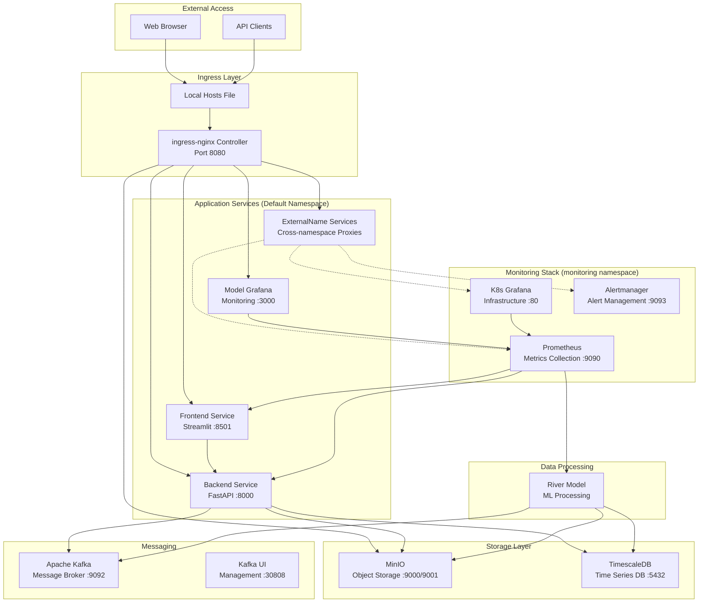

# River Segmentation Stack

A comprehensive Kubernetes-based application stack for river segmentation using machine learning, with integrated monitoring, storage, and messaging capabilities.

## 🏗️ Architecture Overview



## 🚀 Quick Start

### Prerequisites

- **Minikube**: Running with at least 4GB RAM and 2 CPUs
- **kubectl**: Configured to connect to your cluster
- **Helm**: For installing ingress-nginx and kube-prometheus-stack
- **Windows PowerShell**: For running commands (or adapt for your shell)

### 1. Start Minikube

```powershell
# Start Minikube with adequate resources
minikube start --cpus=4 --memory=8192

# Enable required addons
minikube addons enable ingress
minikube addons enable metrics-server
```

### 2. Install Helm Charts

```powershell
# Add required Helm repositories
helm repo add ingress-nginx https://kubernetes.github.io/ingress-nginx
helm repo add prometheus-community https://prometheus-community.github.io/helm-charts
helm repo add strimzi https://strimzi.io/charts/
helm repo update

# Install ingress-nginx
helm install ingress-nginx ingress-nginx/ingress-nginx `
  --namespace ingress-nginx `
  --create-namespace `
  --values nginx/ingress-nginx-values.yaml

# Install Strimzi Kafka operator
helm install strimzi-kafka-operator strimzi/strimzi-kafka-operator `
  --namespace kafka `
  --create-namespace

# Install kube-prometheus-stack
helm install kube-prometheus-stack prometheus-community/kube-prometheus-stack `
  --namespace monitoring `
  --create-namespace `
  --values monitoring/kube-prometheus-stack-values.yaml
```

### 3. Deploy Data Layer

```powershell
# Deploy TimescaleDB
cd databases
kubectl create secret generic timescaledb-secret --from-env-file=timescaledb-secrets.env
kubectl apply -f timescaledb-app.yaml
kubectl apply -f timescaledb-init-job.yaml

# Deploy MinIO
kubectl create secret generic minio-secrets --from-env-file=minio-secrets.env
kubectl apply -f minio-app.yaml
kubectl apply -f minio-bucket-job.yaml
```

### 4. Deploy Messaging Layer

```powershell
# Deploy Kafka
cd ../kafka
kubectl apply -f kafka-config.yaml
kubectl apply -f kafka-service.yaml
kubectl apply -f kafka-ui.yaml
```

### 5. Deploy Application Services

```powershell
# Deploy Backend
cd ../backend
kubectl create configmap backend-config --from-env-file=backend-config.env
kubectl create secret generic backend-secrets --from-env-file=backend-secrets.env
kubectl apply -f backend-app.yaml
kubectl apply -f backend-hpa.yaml

# Deploy Frontend
cd ../frontend
kubectl create configmap frontend-config --from-env-file=frontend-config.env
kubectl apply -f frontend-app.yaml
kubectl apply -f frontend-hpa.yaml

# Deploy Model Grafana
kubectl create secret generic grafana-secrets --from-env-file=grafana-secrets.env
kubectl apply -f grafana-app.yaml
kubectl apply -f grafana-hpa.yaml

# Deploy ML Model
cd ../model
kubectl create configmap river-model-config --from-env-file=river-model-config.env
kubectl create secret generic river-model-secrets --from-env-file=river-model-secrets.env
kubectl apply -f river-model.yaml
kubectl apply -f river-model-hpa.yaml
```

### 6. Configure Monitoring Cross-namespace Access

```powershell
# Create ExternalName services for cross-namespace ingress routing
cd ../monitoring
kubectl apply -f monitoring-proxy-services.yaml
```

### 7. Deploy Ingress Configuration

```powershell
# Apply unified ingress for all services
cd ../nginx
kubectl apply -f river-ingress-nginx-fixed.yaml
```

### 8. Configure Hosts File

Add these entries to `C:\Windows\System32\drivers\etc\hosts`:

```text
# River Segmentation Services - Local Access
127.0.0.1 riverseg.local
127.0.0.1 backend.local
127.0.0.1 minio.local
127.0.0.1 grafanariver.local
127.0.0.1 prometheus.local
127.0.0.1 alertmanager.local
127.0.0.1 grafanak8s.local

# For LAN access (replace with your actual IP)
192.168.1.100 riverseg.local
192.168.1.100 backend.local
192.168.1.100 minio.local
192.168.1.100 grafanariver.local
192.168.1.100 prometheus.local
192.168.1.100 alertmanager.local
192.168.1.100 grafanak8s.local
```

### 9. Start Port Forwarding

```powershell
# Forward ingress controller to access all services
kubectl port-forward -n ingress-nginx service/ingress-nginx-controller 8080:80

# For LAN access
kubectl port-forward -n ingress-nginx service/ingress-nginx-controller 8080:80 --address=YOUR_LAN_IP
```

## 🌐 Service Access Points

| Service           | URL                               | Description                   | Credentials         |
| ----------------- | --------------------------------- | ----------------------------- | ------------------- |
| **Frontend**      | <http://riverseg.local:8080/>     | Streamlit application UI      | N/A                 |
| **Backend**       | <http://backend.local:8080/>      | FastAPI backend API           | N/A                 |
| **MinIO Console** | <http://minio.local:8080/>        | Object storage management     | admin/minio123      |
| **Model Grafana** | <http://grafanariver.local:8080/> | Application monitoring        | admin/admin         |
| **K8s Grafana**   | <http://grafanak8s.local:8080/>   | Infrastructure monitoring     | admin/prom-operator |
| **Prometheus**    | <http://prometheus.local:8080/>   | Metrics collection & querying | N/A                 |
| **Alertmanager**  | <http://alertmanager.local:8080/> | Alert management              | N/A                 |
| **Kafka UI**      | <http://localhost:30808/>         | Kafka cluster management      | N/A                 |

## 📁 Repository Structure

```
k8s-river/
├── README.md                 # This file
├── backend/                  # FastAPI backend service
│   ├── backend-app.yaml
│   ├── backend-hpa.yaml
│   ├── backend-config.env
│   ├── backend-secrets.env
│   └── backend-instructions.md
├── frontend/                 # Streamlit frontend & model Grafana
│   ├── frontend-app.yaml
│   ├── frontend-hpa.yaml
│   ├── frontend-config.env
│   ├── grafana-app.yaml
│   ├── grafana-hpa.yaml
│   ├── grafana-secrets.env
│   ├── frontend-instructions.md
│   └── grafana-instructions.md
├── model/                    # ML model processing service
│   ├── river-model.yaml
│   ├── river-model-hpa.yaml
│   ├── river-model-config.env
│   ├── river-model-secrets.env
│   └── river-model-instructions.md
├── databases/                # TimescaleDB & MinIO storage
│   ├── timescaledb-app.yaml
│   ├── timescaledb-init-job.yaml
│   ├── timescaledb-secrets.env
│   ├── minio-app.yaml
│   ├── minio-bucket-job.yaml
│   ├── minio-secrets.env
│   ├── minio-instructions.md
│   └── timescaledb-instructions.md
├── kafka/                    # Apache Kafka messaging
│   ├── kafka-config.yaml
│   ├── kafka-service.yaml
│   ├── kafka-ui.yaml
│   └── kafka-instructions.md
├── nginx/                    # Ingress configuration
│   ├── river-ingress-nginx-fixed.yaml
│   ├── ingress-nginx-values.yaml
│   └── README.md
└── monitoring/               # Prometheus, Grafana, Alertmanager
    ├── kube-prometheus-stack-values.yaml
    ├── monitoring-proxy-services.yaml
    ├── monitoring-ingress.yaml
    └── README.md
```

## 🔧 Component Details

### Application Services

- **Frontend**: Streamlit-based web interface for river segmentation
- **Backend**: FastAPI REST API handling requests and data processing
- **ML Model**: River segmentation model consuming from Kafka and processing images

### Data Storage

- **TimescaleDB**: PostgreSQL-based time-series database for metrics and results
- **MinIO**: S3-compatible object storage for images and processed data

### Messaging

- **Apache Kafka**: Message broker for streaming image data to ML model
- **Kafka UI**: Web interface for managing Kafka topics and monitoring

### Monitoring

- **Dual Grafana Setup**:
  - Model Grafana: Application-specific metrics and business KPIs
  - K8s Grafana: Kubernetes infrastructure monitoring
- **Prometheus**: Metrics collection and storage
- **Alertmanager**: Alert routing and management

### Networking

- **ingress-nginx**: Unified reverse proxy for all services
- **Cross-namespace routing**: ExternalName services bridge monitoring namespace
- **Custom DNS**: Local hosts file for friendly service names

## 🔍 Verification Commands

### Check Deployment Status

```powershell
# Check all pods across namespaces
kubectl get pods -A

# Check services and their status
kubectl get svc -A

# Check ingress configuration
kubectl get ingress

# Check HPA status
kubectl get hpa
```

### Test Service Connectivity

```powershell
# Test frontend
Invoke-WebRequest -Uri "http://riverseg.local:8080/" -UseBasicParsing -TimeoutSec 10

# Test backend health
Invoke-WebRequest -Uri "http://backend.local:8080/health" -UseBasicParsing -TimeoutSec 10

# Test monitoring services
Invoke-WebRequest -Uri "http://prometheus.local:8080/" -UseBasicParsing -TimeoutSec 10
Invoke-WebRequest -Uri "http://grafanak8s.local:8080/" -UseBasicParsing -TimeoutSec 10
```

### Monitor Resources

```powershell
# Check resource usage
kubectl top nodes
kubectl top pods -A

# Monitor specific deployments
kubectl logs -f deployment/river-backend
kubectl logs -f deployment/river-model
```

## 🛠️ Troubleshooting

### Common Issues

1. **503 Service Unavailable**

   - Check if all pods are running: `kubectl get pods -A`
   - Verify ingress configuration: `kubectl describe ingress river-ingress`
   - Check ExternalName services: `kubectl get svc | findstr kube-prometheus`

2. **DNS Resolution Issues**

   - Verify hosts file entries
   - Test with curl: `curl -H "Host: riverseg.local" http://localhost:8080/`

3. **Resource Constraints**

   - Check node resources: `kubectl top nodes`
   - Adjust resource limits in deployment files
   - Consider increasing Minikube resources

4. **Cross-namespace Access Issues**
   - Verify ExternalName services exist in default namespace
   - Check service endpoints: `kubectl get endpoints`

### Logs and Debugging

```powershell
# Application logs
kubectl logs -f deployment/river-backend
kubectl logs -f deployment/river-frontend
kubectl logs -f deployment/river-model

# Infrastructure logs
kubectl logs -n ingress-nginx deployment/ingress-nginx-controller
kubectl logs -n monitoring deployment/kube-prometheus-stack-prometheus

# Check events
kubectl get events --sort-by=.metadata.creationTimestamp
```

## 📋 Deployment Checklist

- [ ] Minikube started with adequate resources
- [ ] Helm repositories added and updated
- [ ] ingress-nginx installed and running
- [ ] Strimzi Kafka operator installed
- [ ] kube-prometheus-stack installed with custom values
- [ ] TimescaleDB deployed and initialized
- [ ] MinIO deployed with bucket creation
- [ ] Kafka cluster configured and running
- [ ] Backend service deployed with config and secrets
- [ ] Frontend service deployed
- [ ] Model Grafana deployed
- [ ] ML Model service deployed
- [ ] ExternalName proxy services created
- [ ] Unified ingress configuration applied
- [ ] Hosts file updated with service entries
- [ ] Port forwarding started for ingress controller
- [ ] All services accessible via browser
- [ ] Monitoring dashboards configured

## 🔒 Security Considerations

- **Secrets Management**: All sensitive data stored in Kubernetes Secrets
- **Network Policies**: Consider implementing network policies for production
- **TLS**: Add TLS certificates for production deployments
- **RBAC**: Implement proper role-based access control
- **Image Security**: Use specific image tags and scan for vulnerabilities

## 📈 Performance Tuning

- **Resource Limits**: Adjust CPU/memory limits based on actual usage
- **HPA Settings**: Tune auto-scaling thresholds for your workload
- **Persistence**: Enable persistent storage for production environments
- **Replication**: Increase replica counts for high availability

## 🤝 Contributing

1. Fork the repository
2. Create a feature branch
3. Test your changes thoroughly
4. Submit a pull request with detailed description

## 📄 License

This project is licensed under the MIT License - see the LICENSE file for details.

---

_For detailed component-specific instructions, refer to the README files in each subdirectory._
