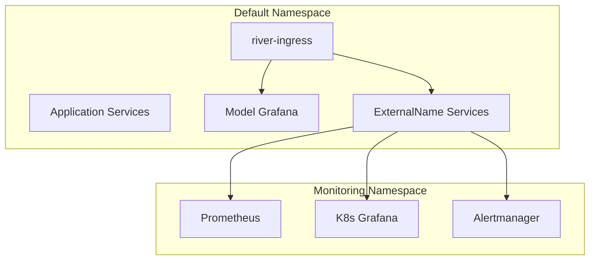

# Monitoring Stack Setup Guide

This guide explains how to set up a comprehensive monitoring stack for the River Segmentation application using Helm and kube-prometheus-stack.

## Overview

The monitoring setup includes:

- **Dual Grafana Instances**: One for model monitoring (application) and one for Kubernetes infrastructure monitoring
- **Prometheus**: Metrics collection and storage
- **Alertmanager**: Alert management and routing
- **Cross-namespace Ingress Access**: All monitoring services accessible via ingress-nginx

## Architecture



## Files Description

### `kube-prometheus-stack-values.yaml`

Custom Helm values for the kube-prometheus-stack installation:

- **Resource Limits**: Optimized for Minikube with limited resources
- **Grafana Configuration**: Disabled built-in Grafana initially to avoid conflicts
- **Persistence**: Disabled for development environment
- **NodeExporter**: Enabled for node-level metrics

### `monitoring-proxy-services.yaml`

ExternalName services that enable cross-namespace ingress routing:

- `kube-prometheus-stack-prometheus`: Proxy to Prometheus in monitoring namespace
- `kube-prometheus-stack-alertmanager`: Proxy to Alertmanager in monitoring namespace
- `kube-prometheus-stack-grafana`: Proxy to K8s Grafana in monitoring namespace

### `monitoring-ingress.yaml`

Legacy ingress configuration (now superseded by unified ingress in nginx folder)

## Setup Instructions

### Step 1: Install kube-prometheus-stack

```powershell
# Add Prometheus community Helm repository
helm repo add prometheus-community https://prometheus-community.github.io/helm-charts
helm repo update

# Install kube-prometheus-stack in monitoring namespace
helm install kube-prometheus-stack prometheus-community/kube-prometheus-stack `
  --namespace monitoring `
  --create-namespace `
  --values monitoring/kube-prometheus-stack-values.yaml
```

### Step 2: Create ExternalName Proxy Services

```powershell
# Apply ExternalName services to enable cross-namespace ingress routing
kubectl apply -f monitoring/monitoring-proxy-services.yaml
```

### Step 3: Verify Installation

```powershell
# Check monitoring namespace services
kubectl get svc -n monitoring

# Check ExternalName proxies in default namespace
kubectl get svc -n default | Select-String -Pattern "kube-prometheus"

# Check pod status
kubectl get pods -n monitoring
```

## Accessing Monitoring Services

All monitoring services are accessible via ingress (no port-forwarding needed):

- **Prometheus**: http://prometheus.local:8080/
- **Alertmanager**: http://alertmanager.local:8080/
- **K8s Grafana**: http://grafanak8s.local:8080/
- **Model Grafana**: http://grafanariver.local:8080/

### Default Credentials

**Kubernetes Grafana (kube-prometheus-stack)**:

- Username: `admin`
- Password: `prom-operator` (default from kube-prometheus-stack) ( k8sGrafana!2025)

## Troubleshooting

### Common Issues

1. **503/502 Errors via Ingress**

   ```powershell
   # Check if ExternalName services exist
   kubectl get svc -n default | findstr kube-prometheus

   # Verify monitoring services are running
   kubectl get svc -n monitoring
   ```

2. **Grafana Pod CrashLoopBackOff**

   ```powershell
   # Check pod logs
   kubectl logs -n monitoring deployment/kube-prometheus-stack-grafana

   # Verify resource limits
   kubectl describe pod -n monitoring -l app.kubernetes.io/name=grafana
   ```

3. **Cross-namespace Access Issues**

   ```powershell
   # Test direct service access
   kubectl port-forward -n monitoring svc/kube-prometheus-stack-grafana 3000:80

   # Test ExternalName proxy
   kubectl port-forward svc/kube-prometheus-stack-grafana 3001:80
   ```

### Updating Configuration

To modify monitoring stack configuration:

```powershell
# Update Helm values
helm upgrade kube-prometheus-stack prometheus-community/kube-prometheus-stack `
  --namespace monitoring `
  --values monitoring/kube-prometheus-stack-values.yaml

# Restart specific deployments if needed
kubectl rollout restart deployment/kube-prometheus-stack-grafana -n monitoring
```

## Key Features

### Dual Grafana Setup

- **Model Grafana**: Monitors application metrics, model performance, and business KPIs
- **K8s Grafana**: Monitors cluster health, resource usage, and infrastructure metrics

### Resource Optimization

- Configured for Minikube with limited resources (4GB RAM, 2 CPU)
- Persistence disabled for development environment
- Resource limits applied to all components

### Unified Access

- Single ingress endpoint for all services
- No need for multiple port-forward commands
- Cross-namespace routing via ExternalName services

## Monitoring Dashboards

### Pre-configured Dashboards (K8s Grafana)

- Kubernetes / Compute Resources / Cluster
- Kubernetes / Compute Resources / Namespace (Pods)
- Kubernetes / Compute Resources / Node (Pods)
- Node Exporter / Nodes

### Custom Dashboards (Model Grafana)

- Model performance metrics
- Application-specific KPIs
- Business metrics and alerts

## Security Considerations

- Default credentials should be changed in production
- Consider enabling TLS/SSL for ingress endpoints
- Implement proper RBAC for monitoring namespace
- Secure access to Prometheus and Alertmanager endpoints

## Performance Tuning

For production environments, consider:

- Enabling persistent storage for metrics retention
- Increasing resource limits based on load
- Configuring proper retention policies
- Setting up remote storage for long-term metrics
