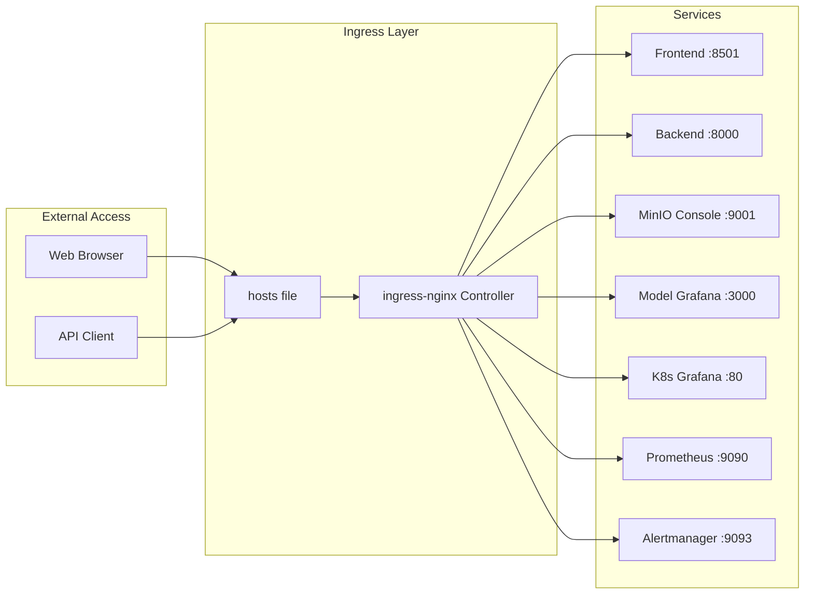

# Ingress-Nginx Setup Guide

This guide explains how to set up and configure ingress-nginx for the River Segmentation application stack, providing unified access to all services through a single entry point.

## Overview

The ingress setup provides:

- **Unified Service Access**: All application and monitoring services accessible via custom hostnames
- **Cross-namespace Routing**: Services from different namespaces accessible through a single ingress
- **Local and LAN Access**: Configured for both localhost and LAN IP access
- **Production-ready Features**: CORS, compression, timeouts, and body size limits

## Architecture



## Files Description

### `ingress-nginx-values.yaml`

Custom Helm values for ingress-nginx installation:

- **NodePort Configuration**: Exposes ingress on port 8080
- **Resource Limits**: Optimized for Minikube environment
- **Controller Settings**: Custom configuration for better performance

### `river-ingress-nginx-fixed.yaml`

Main ingress configuration that routes traffic to all services:

- **Service Routing**: Maps custom hostnames to backend services
- **Cross-namespace Access**: Uses ExternalName services for monitoring namespace
- **Enhanced Features**: CORS, timeouts, compression, and body size limits

## Setup Instructions

### Step 1: Install ingress-nginx via Helm

```powershell
# Add ingress-nginx Helm repository
helm repo add ingress-nginx https://kubernetes.github.io/ingress-nginx
helm repo update

# Install ingress-nginx with custom values
helm install ingress-nginx ingress-nginx/ingress-nginx `
  --namespace ingress-nginx `
  --create-namespace `
  --values nginx/ingress-nginx-values.yaml
```

### Step 2: Apply Ingress Configuration

```powershell
# Apply the main ingress configuration
kubectl apply -f nginx/river-ingress-nginx-fixed.yaml
```

### Step 3: Configure Hosts File

Add entries to your Windows hosts file (`C:\Windows\System32\drivers\etc\hosts`):

```text
# River Segmentation Services - Local Access
127.0.0.1 riverseg.local
127.0.0.1 backend.local
127.0.0.1 minio.local
127.0.0.1 grafanariver.local
127.0.0.1 prometheus.local
127.0.0.1 alertmanager.local
127.0.0.1 grafanak8s.local

# River Segmentation Services - LAN Access (replace with your actual IP)
192.168.1.100 riverseg.local
192.168.1.100 backend.local
192.168.1.100 minio.local
192.168.1.100 grafanariver.local
192.168.1.100 prometheus.local
192.168.1.100 alertmanager.local
192.168.1.100 grafanak8s.local
```

### Step 4: Start Port Forward

```powershell
# Forward ingress-nginx to local port 8080
kubectl port-forward -n ingress-nginx service/ingress-nginx-controller 8080:80

# For LAN access, bind to specific IP
kubectl port-forward -n ingress-nginx service/ingress-nginx-controller 8080:80 --address=YOUR_LAN_IP
```

## Service Access Points

Once configured, all services are accessible via:

| Service | URL | Purpose |
|---------|-----|---------|
| Frontend | <http://riverseg.local:8080/> | Streamlit application UI |
| Backend | <http://backend.local:8080/> | FastAPI backend |
| MinIO Console | <http://minio.local:8080/> | Object storage management |
| Model Grafana | <http://grafanariver.local:8080/> | Application monitoring |
| K8s Grafana | <http://grafanak8s.local:8080/> | Infrastructure monitoring |
| Prometheus | <http://prometheus.local:8080/> | Metrics collection |
| Alertmanager | <http://alertmanager.local:8080/> | Alert management |

## Configuration Details

### Ingress Annotations

The ingress configuration includes several important annotations:

```yaml
annotations:
  # Enable CORS for all services
  nginx.ingress.kubernetes.io/enable-cors: "true"
  nginx.ingress.kubernetes.io/cors-allow-methods: "GET, POST, PUT, DELETE, OPTIONS"
  nginx.ingress.kubernetes.io/cors-allow-headers: "DNT,User-Agent,X-Requested-With,If-Modified-Since,Cache-Control,Content-Type,Range,Authorization"

  # Increase proxy timeouts for long-running requests
  nginx.ingress.kubernetes.io/proxy-connect-timeout: "600"
  nginx.ingress.kubernetes.io/proxy-send-timeout: "600"
  nginx.ingress.kubernetes.io/proxy-read-timeout: "600"

  # Enable gzip compression
  nginx.ingress.kubernetes.io/use-gzip: "true"

  # Set max body size for file uploads
  nginx.ingress.kubernetes.io/proxy-body-size: "100m"
```

### Cross-namespace Service Access

For services in the monitoring namespace, ExternalName services are used:

```yaml
# Example: Accessing Prometheus from default namespace
- host: prometheus.local
  http:
    paths:
      - pathType: Prefix
        path: "/"
        backend:
          service:
            name: kube-prometheus-stack-prometheus  # ExternalName service in default namespace
            port:
              number: 9090
```

## Troubleshooting

### Common Issues

1. **503 Service Temporarily Unavailable**

   ```powershell
   # Check ingress controller status
   kubectl get pods -n ingress-nginx
   
   # Check ingress configuration
   kubectl describe ingress river-ingress
   
   # Verify backend services are running
   kubectl get svc
   ```

2. **DNS Resolution Issues**

   ```powershell
   # Verify hosts file entries
   Get-Content C:\Windows\System32\drivers\etc\hosts | Select-String "local"
   
   # Test DNS resolution
   nslookup riverseg.local
   ```

3. **Port Forward Connection Issues**

   ```powershell
   # Check if port 8080 is already in use
   netstat -an | findstr :8080
   
   # Kill any existing port forwards
   taskkill /F /IM kubectl.exe
   
   # Restart port forward
   kubectl port-forward -n ingress-nginx service/ingress-nginx-controller 8080:80
   ```

### Testing Service Access

```powershell
# Test basic connectivity
Invoke-WebRequest -Uri "http://riverseg.local:8080/" -UseBasicParsing -TimeoutSec 10

# Test with custom headers
Invoke-WebRequest -Uri "http://backend.local:8080/health" -UseBasicParsing -TimeoutSec 10

# Test CORS functionality
Invoke-WebRequest -Uri "http://backend.local:8080/" -Method OPTIONS -UseBasicParsing
```

## Performance Tuning

### Ingress Controller Optimization

For better performance, consider adjusting:

```yaml
# In ingress-nginx-values.yaml
controller:
  config:
    # Increase worker processes
    worker-processes: "2"
    
    # Optimize buffer sizes
    proxy-buffer-size: "16k"
    proxy-buffers-number: "8"
    
    # Enable keep-alive
    upstream-keepalive-connections: "100"
```

### Resource Allocation

Monitor and adjust resource limits based on usage:

```powershell
# Check ingress controller resource usage
kubectl top pods -n ingress-nginx

# Monitor ingress controller logs
kubectl logs -n ingress-nginx deployment/ingress-nginx-controller -f
```

## Security Considerations

### Production Hardening

For production deployments:

1. **Enable TLS/SSL**
   - Add TLS certificates to ingress configuration
   - Configure cert-manager for automatic certificate management

2. **Restrict Access**
   - Implement IP whitelisting
   - Add authentication middleware

3. **Rate Limiting**
   - Configure rate limiting annotations
   - Set connection limits per IP

### Example TLS Configuration

```yaml
spec:
  tls:
    - hosts:
        - riverseg.local
        - backend.local
      secretName: river-tls-secret
```

## Monitoring Ingress Performance

### Key Metrics to Watch

```powershell
# Check ingress metrics
kubectl get --raw /metrics | Select-String "nginx_ingress"

# Monitor connection statistics
kubectl exec -n ingress-nginx deployment/ingress-nginx-controller -- nginx -T
```

### Log Analysis

```powershell
# View access logs
kubectl logs -n ingress-nginx deployment/ingress-nginx-controller | Select-String "GET\|POST"

# Check error logs
kubectl logs -n ingress-nginx deployment/ingress-nginx-controller | Select-String "error\|warn"
```

## Advanced Configuration

### Custom Error Pages

Configure custom error pages for better user experience:

```yaml
annotations:
  nginx.ingress.kubernetes.io/custom-http-errors: "404,503"
  nginx.ingress.kubernetes.io/default-backend: "custom-error-pages"
```

### Load Balancing

For multiple replicas, configure load balancing:

```yaml
annotations:
  nginx.ingress.kubernetes.io/load-balance: "round_robin"
  nginx.ingress.kubernetes.io/upstream-hash-by: "$request_uri"
```

This setup provides a robust, scalable ingress solution for the River Segmentation application stack with comprehensive monitoring and troubleshooting capabilities.
